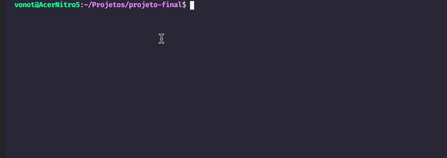

<h1 align="center">Chuva de Meteoros DevMedia</h1>

<p align="center" id="sobre">Minha implementação do <a href='https://www.devmedia.com.br/javascript/Construindo-projeto-completo'>Projeto Chuva de Meteoros</a> proposto pela <a href='https://github.com/DevMedia'>@DevMedia</a> ao final do curso de JavaScript.</p>

<p align="center">
<a href='https://www.linkedin.com/in/vonot/'></a>


</p>



<h2 id="tabela-conteudo">Tabela de Conteudo</h2>

<ul>
  <li><a href="#sobre">Sobre</a></li>
  <li><a href="#tabela-conteudo">Tabela de Conteudo<a></li>
   <li><a href="#funcionalidades">Funcionalidades</a>
    <ul>
      <li>Screenshots</li>
     </ul>
   </li>
  <li>Como Rodar
   <ul>
      <li>Pré Requisitos</li>
      <li>Clonando Repositório</li>
      <li>Iniciando Aplicação</li>
    </ul>
  </li>
</ul>

<h2 id="funcionalidades">Funcionalidades</h2>
<p>Descrição basica da implementação</p>
<h3>Chuvas de Meteoros Ocorrendo</h3>
<p>Condição para a lista de meteoros ocorrendo</p>
<h3>Chuvas de Meteoros Próximas</h3>
<p>Condição para a lista de meteoros proximos</p>

<h2>Como Rodar</h2>
<p>Explição basica sobre o node / yarn necessario para rodar</p>
```bash
# Clone o Repositoria
$ git clone https://github.com/
```
