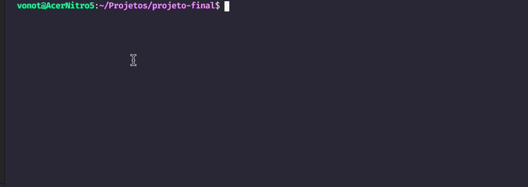
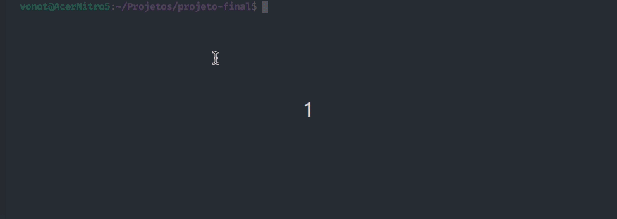

<h1 align="center" id="sobre">:comet: Chuva de Meteoros DevMedia</h1>

<p align="center">Minha implementação do <a href='https://www.devmedia.com.br/javascript/Construindo-projeto-completo' target="_blank">Projeto Chuva de Meteoros</a> proposto pela <a href='https://github.com/DevMedia'>@DevMedia</a> ao final do curso de JavaScript.</p>

<p align="center">
<a href='https://www.linkedin.com/in/vonot/'></a>


</p>


<h2 id="tabela-conteudo">:book: Tabela de Conteudo</h2>

<ul>
  <li><a href="#sobre">Sobre</a></li>
  <li><a href="#tabela-conteudo">Tabela de Conteudo<a></li>
   <li><a href="#funcionalidades">Funcionalidades</a>
    <ul>
      <li><a href="#ocorrendo">Chuvas de Meteoros Ocorrendo</a></li>
      <li><a href="#proximas">Chuvas de Meteoros Próximas</a></li>
     </ul>
   </li>
    <li><a href="#how">Como Rodar</a>
   <ul>
     <li><a href="#req">Pré Requisitos</a></li>
     <li><a href="#clone">Clonando Repositório</a></li>
     <li><a href="#iniciando">Iniciando Aplicação</a></li>
    </ul>
  </li>
    <li><a href="#tecnologia">Tecnologia Utilizadas</a></li>
    <li><a href="#autor">Autor</a></li>
    <li><a href="#licenca">Licença</a></li>
</ul>

<h2 id="funcionalidades">:thinking: Funcionalidades</h2>
<p>
  O sistema desenvolvido em módulos recebe um arquivo .JS externo com um array de objetos contendo informações sobre chuvas de meteoros:
  
  ```js
  const chuva de meteoros = [
  {nome: 'meteoro', inicio: '01/28', fim: '02/21', pico: 'Fev 8', ascensao: 210, declinacao: -59, velocidade: 56, thz: '6', intensidade: 'Média'},
  ....
  ];
  ```
  
  O algoritimo deve tratar esses dados e apresenta-los ao usuario na forma de duas listas diferentes:
  * <strong>Chuvas de Meteoros Ocorrendo</strong> e
  * <strong>Chuvas de Meteoros Próximas</strong>
</p>
  
<h3 id="ocorrendo">Chuvas de Meteoros Ocorrendo</h3>

<p>Para criarmos a lista de Chuvas Ocorrendo é necessário capturar a data do computador do usuario e verificarmos se existe alguma chuva de meteoro ocorrendo naquele dia.</p>

<p>Caso houver algum, devemos imprimir o <strong> nome do meteoro </strong>, a <strong>intensidade da chuva </strong>, o <strong>hemisfério que esta ocorrendo o evento </strong> e o periodo de duração do fenômeno</strong>.</p>

<p>Não podemos esquecer também de converter o data para o formato de data local do usuário, e considerar a possibilidade de não estar ocorrendo nenhuma chuva.</p>


<h3 id="proximas">Chuvas de Meteoros Próximas</h3>
<p>Análogo o processo de exibir as chuvas ocorrendo, iremos exibir as chuvas que irão acontecer em um periodo de até dois meses.</p>


<h2 id="how">Como Rodar</h2>
<h3 id="req">Requisitos</h3>
Para excutar o projeto é necessário ter instalado no seu computador:
<a href="https://nodejs.org/en/" target"_blank"><strong>NodeJS</strong></a> <a href="https://yarnpkg.com/" target="_blank"><strong>YarnPKG</strong></a>

<h4>Guia de Instalação de Requisitos para cada SO:</h4>

<ul>
  <li><a href="#linux">Linux (Ubuntu/Debian)</a></li>
  <li><a href="#mac-win">MAC e Windows</a></li>
</ul>

<strong>Se ocorrer algum problema durante a instalação recomendo procurar ajuda na documentação dos projetos.</strong>

<h5 id="linux">Linux</h5>

```sh
# Utilizando o Ubuntu
curl -fsSL https://deb.nodesource.com/setup_lts.x | sudo -E bash -
sudo apt-get install -y nodejs

# Utilizando o Debian, como root
curl -fsSL https://deb.nodesource.com/setup_lts.x | bash -
apt-get install -y nodejs
```

Depois de instalado o NodeJS, precisamos verificar se foi instaalado também o gerenciador de pacotes <strong><a href="https://www.npmjs.com/" target="_blank">NPM</a></strong> por meio do comando:

```sh
npm -v
```
Se alguma versão for retornada o NPM foi instalado com sucesso, caso contrario podemos instala-lo de forma manual

```sh
sudo apt install npm
```
Depois podemos verificar a versão do NPM novamente e você verá que está instalado.

Por ultimo precisamos instalar o Yarn
```sh
npm install -g yarn
yarn -v
```
Agora só falta <a href="#clone">clonar o projeto e executa-lo</a>

<h5 id="mac-win">Mac OS e Windows</h5>

Para instalar o NodeJs no sistema Mac e Windows voçê só precisa acessar o [site oficial](https://nodejs.org/en/download/), fazer o download do instalador para o seu sistema, recomendo a versão LTS, e executar o processo de instalação padrão para qualquer software

Após instala-lo vamos verificar se esta tudo ok executando o seguinte comando no terminal.
Recomendo que execute o terminal como administrador para quem está utilizando o windows

```sh
node -v
npm -v

```

Caso apareça a versão do Node e o NPM tudo foi feito correntamente e podemos instalar o YarnPKG, caso contrario recomendo dar uma olhada na [documentação do NodeJs](https://nodejs.org/en/docs/)

Com o node instalado, instalar o yarn é extremamente simples basta excutarmos este comando no terminal

```sh
npm install --global yarn
yarn -v
```

Se a versão o Yarn foi mostrada corretamente podemos partir para a parte de <a href="#clone">clonagem do projeto</a>

<h3 id="clone">Clonando o repositório</h3>

Para clonar a aplicação é necessário ter instalado o Git em sua maquina, mas vou partir do principio de que você já o tenha, caso contrario, veja como instalar no site oficial do <a href="https://git-scm.com/downloads" target="_blank">Git</a>

Basta abrir o seu terminal em uma pasta de sua escolha e rodar o comando Git Clone:
```sh
git clone https://github.com/vonot/chuva-meteoros-devmedia.git
```
Após clonarmos o repositório temos que instalar as dependencias do projeto por meio do Yarn:

```sh
yarn install
```

Se você realizou todos os processos corretamente já está tudo preparado para <a href="#inciando">iniciarmos a aplicação</a>.
<h3 id="iniciando">Iniciando aplicação</h3>
Para executar só precisamos abiri a pasta do projeto com o terminal e executar o comando:

```sh
yarn start
```

<h2 id="tecnologia">Técnologia Utilizadas</h2>
Para desenvolver esse proejeto foram utilizados:
<ul>
  <li><a href="https://nodejs.org/en/" target="_blank">NodeJS</a></li>
  <li><a href="https://yarnpkg.com/" target="_blank">YarnPKG</a></li>
  <li><a href="https://babeljs.io/" target="_blank">BabelJS</a></li>
  <li><a href="https://expressjs.com/" target="_blank">Express</a></li>
 </ul>
<h2 id="autor">Autor</h2>
<h2 id="licenca">Licença</h2>
